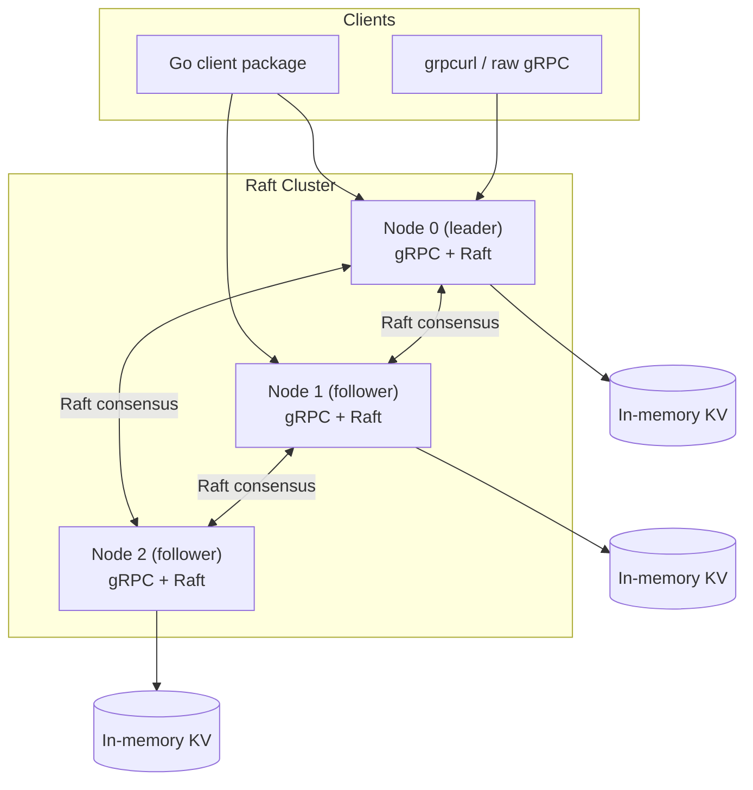
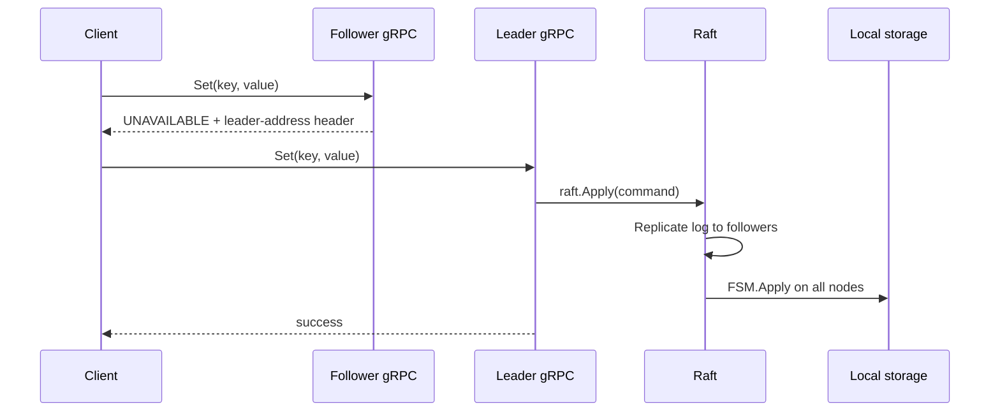

# dkvs System Overview

This document explains how **dkvs** (Distributed Key-Value Store) works internally: its components, operating modes, request flows, and design trade-offs.

For setup and usage, see [README.md](README.md). For AI agent conventions, see [AGENTS.md](AGENTS.md).

---

## What dkvs is

dkvs is a small distributed key-value store written in Go. It exposes a gRPC API for `Set`, `Get`, and `Delete`, and uses **HashiCorp Raft** for leader election and replicated writes. The default storage backend is an in-memory map with optional per-key TTL and snapshot support.

The project is a reference implementation: easy to read, run locally, and extend—not a full production datastore.

---

## High-level architecture



Each node runs two network listeners:

| Listener | Default example | Purpose |
|----------|-----------------|---------|
| **gRPC** | `:50050` | Client-facing API (`Set`, `Get`, `Delete`) |
| **Raft transport** | `127.0.0.1:12100` | Leader election, log replication between nodes |

Every node also holds a local copy of the key-value data, updated by the Raft FSM when log entries are committed.

---

## Core components

### 1. gRPC server (`server/`)

The `Server` struct implements `proto.KVStoreServer` and handles three RPCs:

| RPC | Raft mode | Non-Raft mode |
|-----|-----------|---------------|
| **Set** | Leader submits JSON command to `raft.Apply`; FSM writes on all nodes | Direct write to local storage; async fan-out to peers |
| **Get** | Local read from storage (no Raft round-trip) | Local read |
| **Delete** | Same as Set (leader + `raft.Apply`) | Direct delete + async peer replication |

Key files:

- `server/server.go` — handlers, peer replication, `Listen`, `Shutdown`
- `server/raft.go` — FSM, Raft initialization, snapshot compaction
- `server/cluster.go` — `RunClusterNode`, voter bootstrap via `AddVoter`
- `server/options.go` — functional configuration (`WithRaft`, `WithStorage`, etc.)
- `server/hooks.go` — pre/post RPC hooks
- `server/logging.go` — structured logging and gRPC interceptor

### 2. Raft FSM (`server/raft.go`)

Raft log entries are JSON commands:

```json
{ "op": "set", "key": "k", "value": "v", "ttl": 0 }
{ "op": "delete", "key": "k" }
```

The `kvFSM` applies committed entries to the local `kvstore.Storage`:

- **`set`** → `Set` or `SetWithTTL` depending on `ttl`
- **`delete`** → `Delete`

When the storage implements `kvstore.SnapshotStore`, the FSM can snapshot and restore state to compact the Raft log. A background goroutine optionally triggers snapshots when `WithSnapshotThreshold(N)` is set and `N > 0` committed entries have accumulated since the last snapshot.

Raft persistence:

- **BoltDB** at `{dataDir}/raft.db` — stable store and log
- **File snapshots** at `{dataDir}/snap/` — retained snapshots (keep 2)

### 3. Storage layer (`kvstore/`)

The `Storage` interface defines four operations:

```go
Set(key, value string)
SetWithTTL(key, value string, ttl time.Duration)
Get(key string) (string, bool)
Delete(key string) bool
```

The default in-memory implementation (`kvstore/kvstore.go`):

- Thread-safe map protected by `sync.RWMutex`
- **TTL**: lazy expiration on `Get`; expired keys are deleted asynchronously
- **Snapshots**: JSON serialization of the full map for Raft restore

Custom backends can be injected via `server.WithStorage(...)`. Implement `SnapshotStore` if Raft snapshots should capture storage state.

### 4. Client (`client/`)

The Go client wraps the generated gRPC stub and adds:

- Per-RPC timeout (default 3s)
- Leader redirect on `Set` and `Delete` (default 3 retries)
- Exponential backoff with jitter between redirect attempts

**Get** does not follow leader redirects—it always reads from the initially configured address.

### 5. Protocol (`proto/`)

Service definition in `proto/kvstore.proto`:

```
service KVStore {
  rpc Set(SetRequest) returns (SetResponse);
  rpc Get(GetRequest) returns (GetResponse);
  rpc Delete(DeleteRequest) returns (DeleteResponse);
}
```

Generated Go stubs live in `proto/*.pb.go` (gitignored; regenerate with `make build`).

---

## Operating modes

### Raft mode (primary)

Enabled via `server.WithRaft(dataDir, nodeID, raftBindAddr, peers, bootstrap)`.

**Write path:**



1. Client sends `Set` or `Delete` to any node.
2. If the node is a **follower**, it returns `UNAVAILABLE` and sets the `leader-address` response header.
3. The leader marshals the command and calls `raft.Apply`.
4. After commit, the FSM applies the command on every node.
5. The leader returns success to the client.

**Read path:**

1. Client sends `Get` to any node.
2. The node reads directly from local storage and returns the result.
3. No Raft quorum is involved.

This means reads are fast but may be **eventually consistent** on followers: a follower can serve a read before it has applied the latest committed write.

### Non-Raft peer mode (legacy)

Enabled via `server.WithPeers([]string)` without Raft.

- Writes go to local storage immediately.
- The server asynchronously replicates to peers over gRPC, marking requests with `x-replicated: true` to prevent replication loops.
- There is no consensus guarantee—this mode is best-effort only.

---

## Cluster bootstrap

The example CLI (`_examples/raft_cluster/main.go`) uses `server.RunClusterNode`:

1. Start follower nodes first (each with unique `-id`, `-raft-addr`, `-grpc`, `-data`).
2. Start the bootstrap leader with `-bootstrap` and `-voter id=...,addr=...` flags.
3. The leader runs a background goroutine that retries `AddVoter` for each specified voter until all are reachable and added to the Raft configuration.

Typical 3-node ports:

| Node | Raft address | gRPC address |
|------|--------------|--------------|
| node0 (leader) | `127.0.0.1:12100` | `:50050` |
| node1 | `127.0.0.1:12101` | `:50051` |
| node2 | `127.0.0.1:12102` | `:50052` |

---

## Authentication and hooks

**Bearer token auth** (`WithAuthToken`): When configured, every RPC requires `authorization: Bearer <token>` in request metadata. Implemented as a built-in pre-hook in `NewServer`.

**Custom hooks** (`WithPreHook`, `WithPostHook`): Run before/after each RPC. A pre-hook error aborts the operation.

---

## Snapshots and compaction

When `WithSnapshotThreshold(N)` is set with `N > 0`:

1. A background goroutine polls Raft's last applied index every second.
2. When `lastIndex - lastSnapshotIndex >= N`, it triggers `raft.Snapshot()`.
3. The FSM delegates to `kvstore.SnapshotStore.Snapshot()` to capture storage state.
4. Old log entries can be compacted, keeping the Raft log bounded.

Set threshold to `0` to disable automatic snapshots.

---

## Client leader redirect

On write failures, the client tries to find a new leader:

1. **Primary**: read `leader-address` from gRPC response headers.
2. **Fallback**: parse `"leader is <addr>"` from the error message.

If a new address is found, the client re-dials and retries with exponential backoff (100ms base, 2s cap, random jitter).

**Important limitation:** The server sets `leader-address` from `raftInstance.Leader()`, which is the **Raft transport address** (e.g. `127.0.0.1:12100`), not the gRPC address (e.g. `:50050`). In the default setup, client redirects may target a port that does not serve gRPC. For reliable redirects, writes should go directly to the leader's gRPC port, or the server would need to map Raft IDs to gRPC addresses.

---

## Graceful shutdown

`Server.Shutdown()`:

1. Shuts down the Raft instance.
2. Closes the BoltDB store.

Always call shutdown before exit—especially on Windows—to avoid BoltDB file lock errors on restart.

`Listen` handles `SIGINT`/`SIGTERM` and stops the gRPC server gracefully.

---

## Configuration reference

Server options (functional options in `server/options.go`):

| Option | Description |
|--------|-------------|
| `WithStorage(storage)` | Custom storage backend |
| `WithDefaultTTL(d)` | Default TTL when request TTL is 0 |
| `WithPeers([]string)` | Non-Raft peer gRPC addresses |
| `WithRaft(...)` | Enable Raft consensus |
| `WithSnapshotThreshold(n)` | Auto-snapshot after N entries (0 = off) |
| `WithAuthToken(token)` | Require Bearer token |
| `WithPreHook` / `WithPostHook` | RPC hooks |
| `WithAdminAddr` / `WithTLS` | Placeholders (not wired) |

Environment:

- `KVSTORE_LOG` — log level override (`debug`, `info`, etc.)

---

## Design trade-offs

| Choice | Benefit | Cost |
|--------|---------|------|
| Local reads (no Raft for Get) | Low latency, simple handlers | Followers may serve slightly stale data |
| In-memory default storage | Fast, easy to understand | Data lost on restart unless snapshotted/restored |
| JSON Raft commands | Human-readable log entries | Less compact than binary encoding |
| Separate Raft and gRPC ports | Clean separation of concerns | Leader redirect header does not map to gRPC |
| Minimal auth (Bearer token) | Easy to enable for trusted networks | Not suitable for untrusted environments without TLS |

---

## Repository layout

```
dkvs/
├── server/              gRPC server, Raft, cluster runner
├── kvstore/             Storage interface + in-memory implementation
├── client/              Leader-aware Go client
├── proto/               Protobuf definitions
├── _examples/
│   ├── raft_cluster/    Cluster node CLI
│   └── client/          Raw gRPC example
├── AGENTS.md            AI agent guidance
├── overview.md          This document
└── README.md            Quick start and user docs
```

---

## Extending dkvs

Common extension points:

1. **New RPC methods** — update `proto/kvstore.proto`, regenerate stubs, add handler in `server/server.go`, extend FSM command handling if writes are involved.
2. **Persistent storage** — implement `kvstore.Storage` (+ `SnapshotStore`) and pass via `WithStorage`.
3. **Stronger consistency for reads** — route `Get` through Raft (e.g. linearizable read via `raft.Apply` with a read command, or lease-based reads).
4. **Leader redirect fix** — maintain a Raft-ID → gRPC-address map and return the gRPC address in `leader-address`.
5. **TLS/mTLS** — wire `WithTLS` into gRPC server and client dial options.
